# 🚀 توثيق قاعدة بيانات UniCore-OS

---

## 1. نظرة عامة

هذا المستند يشرح بالتفصيل هيكلية قاعدة بيانات نظام **UniCore-OS**، بما في ذلك الجداول، العلاقات، والحقول الرئيسية. تم تصميم قاعدة البيانات لتكون مرنة وقابلة للتطوير، مع التركيز على نزاهة البيانات والأداء.

- **النظام:** SQLite (للتطوير) / PostgreSQL (للإنتاج)
- **ORM:** Prisma 5.22.0
- **عدد الجداول:** 20 جدول

---

## 2. مخطط العلاقات (ERD)

تم إنشاء هذا المخطط تلقائياً باستخدام `prisma-erd-generator`.

---

## 3. شرح الجداول الرئيسية

### 3.1 جداول المستخدمين والصلاحيات (Core User & Auth)

| الجدول | الوصف |
|---|---|
| `User` | الجدول المركزي للمستخدمين، يحتوي على معلومات الدخول الأساسية. |
| `UserProfile` | يحتوي على المعلومات الشخصية الإضافية للمستخدم (الاسم، الصورة، إلخ). |
| `Permission` | قائمة ثابتة بجميع الصلاحيات الذرية في النظام (52 صلاحية). |
| `Role` | الأدوار الديناميكية التي ينشئها السوبر أدمن. |
| `RolePermission` | جدول الربط بين الأدوار والصلاحيات (Many-to-Many). |
| `UserRole` | جدول الربط بين المستخدمين والأدوار (Many-to-Many). |

### 3.2 جداول الهيكل الأكاديمي (Academic Structure)

| الجدول | الوصف |
|---|---|
| `College` | الكليات. |
| `Department` | الأقسام (تابعة للكلية). |
| `Major` | التخصصات (تابعة للقسم). |
| `Semester` | الفصول الدراسية (مثل: 2025-1). |
| `Course` | المقررات الدراسية (مثل: CS101). |
| `CourseOffering` | الشعب الدراسية (مثل: CS101 - Section 1 - Fall 2025). |
| `Enrollment` | تسجيل الطلاب في الشعب (Many-to-Many). |

### 3.3 جداول الاختبارات (Quizzes)

| الجدول | الوصف |
|---|---|
| `Quiz` | الاختبارات (الأسئلة، الإعدادات، إلخ). |
| `Question` | الأسئلة داخل الاختبار. |
| `Option` | الخيارات لكل سؤال. |
| `QuizAttempt` | محاولات الطلاب لأداء الاختبار. |
| `Answer` | إجابات الطلاب على كل سؤال. |

### 3.4 جداول النظام (System)

| الجدول | الوصف |
|---|---|
| `File` | الملفات المرفوعة. |
| `Notification` | الإشعارات المرسلة للمستخدمين. |
| `AuditLog` | سجل التدقيق لجميع العمليات المهمة. |
| `SystemSetting` | إعدادات النظام العامة. |

---

## 4. العلاقات الرئيسية

- **User ↔ Role:** علاقة Many-to-Many عبر `UserRole`.
- **Role ↔ Permission:** علاقة Many-to-Many عبر `RolePermission`.
- **College → Department → Major:** علاقة One-to-Many هرمية.
- **Course ↔ User (Instructor):** علاقة Many-to-Many عبر `CourseOffering`.
- **CourseOffering ↔ User (Student):** علاقة Many-to-Many عبر `Enrollment`.
- **Quiz → Question → Option:** علاقة One-to-Many هرمية.
- **Quiz ↔ User (Student):** علاقة Many-to-Many عبر `QuizAttempt`.

---

## 5. ملاحظات مهمة

- **Soft Delete:** معظم الجداول تحتوي على حقل `deletedAt` لتفعيل الحذف الناعم.
- **Timestamps:** جميع الجداول تحتوي على `createdAt` و `updatedAt`.
- **CUID:** المفاتيح الأساسية (IDs) تستخدم `cuid()` لضمان عدم التكرار.

---

**هذا التوثيق يعكس الحالة الحالية لقاعدة البيانات وهو مرجع أساسي للمطورين.**
